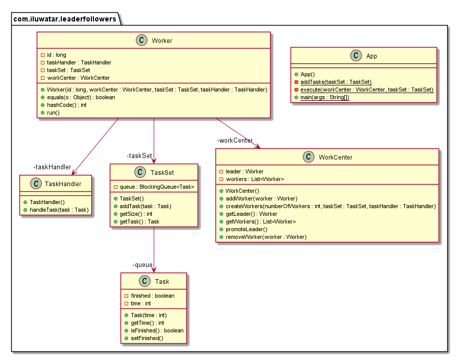

## Intent

To manage a set of worker threads efficiently, where multiple threads take turns sharing a set of event sources in order to utilize fewer resources than one-thread-per-source.

## Explanation

Real-world Example

> Imagine managing a busy restaurant with multiple servers and a single host. The host acts as the "leader" and is responsible for greeting guests, managing the waitlist, and seating guests. Once the guests are seated, the host returns to the entrance to manage new arrivals. The servers, or "followers," wait for the host to assign them tables. This assignment is done on a rotational basis where the next available server takes the next group of guests. This system ensures that the host efficiently handles the incoming flow of guests while servers focus on providing service, similar to how the Leader and Followers pattern manages threads and tasks in a software system. This approach optimizes resource utilization (in this case, staff) and ensures smooth operations during peak times, much like it optimizes thread usage in computing environments.

In plain words

> The Leader and Followers design pattern utilizes a single leader thread to distribute work among multiple follower threads, effectively managing task delegation and thread synchronization to maximize resource efficiency.

[martinfowler.com](https://martinfowler.com/articles/patterns-of-distributed-systems/leader-follower.html) says

> Select one server in the cluster as a leader. The leader is responsible for taking decisions on behalf of the entire cluster and propagating the decisions to all the other servers.

## Programmatic Example

The Leader/Followers pattern is a concurrency pattern where one thread (the leader) waits for work to arrive, de-multiplexes, dispatches, and processes the work. Once the leader finishes processing the work, it promotes one of the follower threads to be the new leader. This pattern is useful for enhancing CPU cache affinity, minimizing locking overhead, and reducing event dispatching latency.

In the provided code, we have a `WorkCenter` class that manages a group of `Worker` threads. One of these workers is designated as the leader and is responsible for receiving and processing tasks. Once a task is processed, the leader promotes a new leader from the remaining workers.

```java
// WorkCenter class
public class WorkCenter {

  @Getter
  private Worker leader;
  private final List<Worker> workers = new CopyOnWriteArrayList<>();

  // Method to create workers and set the initial leader
  public void createWorkers(int numberOfWorkers, TaskSet taskSet, TaskHandler taskHandler) {
    for (var id = 1; id <= numberOfWorkers; id++) {
      var worker = new Worker(id, this, taskSet, taskHandler);
      workers.add(worker);
    }
    promoteLeader();
  }

  // Method to promote a new leader
  public void promoteLeader() {
    Worker leader = null;
    if (!workers.isEmpty()) {
      leader = workers.get(0);
    }
    this.leader = leader;
  }
}
```

In the `Worker` class, each worker is a thread that waits for tasks to process. If the worker is the leader, it processes the task and then promotes a new leader.

```java
// Worker class
public class Worker implements Runnable {

  private final long id;
  private final WorkCenter workCenter;
  private final TaskSet taskSet;
  private final TaskHandler taskHandler;

  @Override
  public void run() {
    while (!Thread.interrupted()) {
      try {
        if (workCenter.getLeader() != null && !workCenter.getLeader().equals(this)) {
          synchronized (workCenter) {
            if (workCenter.getLeader() != null && !workCenter.getLeader().equals(this)) {
              workCenter.wait();
              continue;
            }
          }
        }
        final Task task = taskSet.getTask();
        synchronized (workCenter) {
          workCenter.removeWorker(this);
          workCenter.promoteLeader();
          workCenter.notifyAll();
        }
        taskHandler.handleTask(task);
        workCenter.addWorker(this);
      } catch (InterruptedException e) {
        Thread.currentThread().interrupt();
        return;
      }
    }
  }
}
```

In the `App` class, we create a `WorkCenter`, add tasks to a `TaskSet`, and then start the workers. The leader worker will start processing the tasks, and once it finishes a task, it will promote a new leader.

```java
// App class
public class App {

  public static void main(String[] args) throws InterruptedException {
    var taskSet = new TaskSet();
    var taskHandler = new TaskHandler();
    var workCenter = new WorkCenter();
    workCenter.createWorkers(4, taskSet, taskHandler);
    addTasks(taskSet);
    startWorkers(workCenter);
  }

  private static void addTasks(TaskSet taskSet) throws InterruptedException {
    var rand = new SecureRandom();
    for (var i = 0; i < 5; i++) {
      var time = Math.abs(rand.nextInt(1000));
      taskSet.addTask(new Task(time));
    }
  }

  private static void startWorkers(WorkCenter workCenter) throws InterruptedException {
    var workers = workCenter.getWorkers();
    var exec = Executors.newFixedThreadPool(workers.size());
    workers.forEach(exec::submit);
    exec.awaitTermination(2, TimeUnit.SECONDS);
    exec.shutdownNow();
  }
}
```

This is a basic example of the Leader/Followers pattern. The leader worker processes tasks and promotes a new leader once it finishes a task. The new leader then starts processing the next task, and the cycle continues.

## Class diagram



## Applicability

* Useful in scenarios where programs need to handle multiple services on a single thread to avoid resource thrashing and to improve scalability.
* Applicable in server environments where multiple client requests must be handled concurrently with minimal resource consumption.

## Known Uses

* Network servers handling multiple incoming connections.
* Event-driven applications that manage a large number of input/output sources.

## Consequences

Benefits:

* Reduces the number of threads and context switching, leading to better performance and lower resource utilization.
* Improves system scalability and responsiveness.

Trade-offs:

* Increased complexity in managing the synchronization between leader and followers.
* Potential for underutilization of resources if not correctly implemented.

## Related Patterns

* [Half-Sync/Half-Async](https://java-design-patterns.com/patterns/half-sync-half-async/): Leader and Followers can be seen as a variation where the synchronization aspect is divided between the leader (synchronous handling) and followers (waiting asynchronously).
* [Thread Pool](https://java-design-patterns.com/patterns/thread-pool/): Both patterns manage a pool of worker threads, but Thread Pool assigns tasks to any available thread rather than using a leader to distribute work.

## Credits

* [Pattern-Oriented Software Architecture Volume 2: Patterns for Concurrent and Networked Objects](https://amzn.to/3UgC24V)
* [Java Concurrency in Practice](https://amzn.to/4aRMruW)
